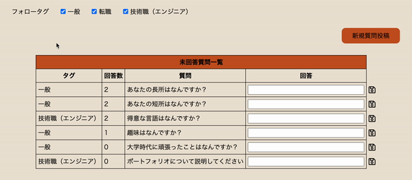
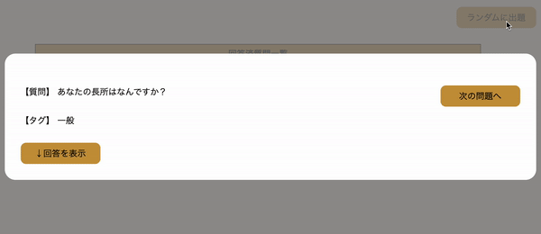
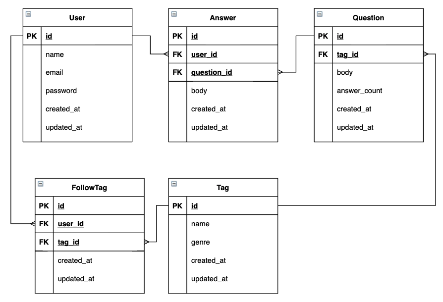

# どこでも就活面接対策

## サイト概要
面接対策のためのアプリケーションです。サイトURLは[こちら](https://interview-memo.herokuapp.com/)です。

主な機能は下記2点です。
1. 全ユーザが投稿した質問を閲覧することができ、自身の回答を保存することができる
> - 未回答の質問は回答数順に表示されるので、回答数が増えるほど精度が高まる
> - タグの切替で表示する質問内容を変更

2. 自身の回答一覧からランダムに問題を表示することができる

## ターゲットユーザ
就活生

## 技術的なポイント
- チェックボックスの切替や、回答の追加・更新・削除ボタンについては、JavaScriptでイベントを検知し、ajax通信
- 回答の追加・削除と、回答数の増減はトランザクション化し、データの不整合を防止

## 設計書
- ER図

- [ワイヤーフレーム](https://drive.google.com/file/d/1cQ815B46W89HcBT3TZ_J7HIxHFL0IVVR/view?usp=sharing)
- [テーブル定義書](https://docs.google.com/spreadsheets/d/1Zgv-z-5oRiKLW6O12mbchX7M7y8xVtekIiTGu9TEwpU/edit?usp=sharing)
- [アプリケーション詳細設計書](https://docs.google.com/spreadsheets/d/1mUQ1pCdh6cuMJqBw-ZwwMPLrV0TdNMFjp5Q7xWQ9jnA/edit?usp=sharing)

## テスティングフレームワーク
- RSpec

## 開発環境
- OS：Linux(CentOS)
- 言語：HTML,CSS,JavaScript,Ruby,SQL
- フレームワーク：Ruby on Rails
- JSライブラリ：jQuery
- IDE：Cloud9

## 本番環境
- Heroku